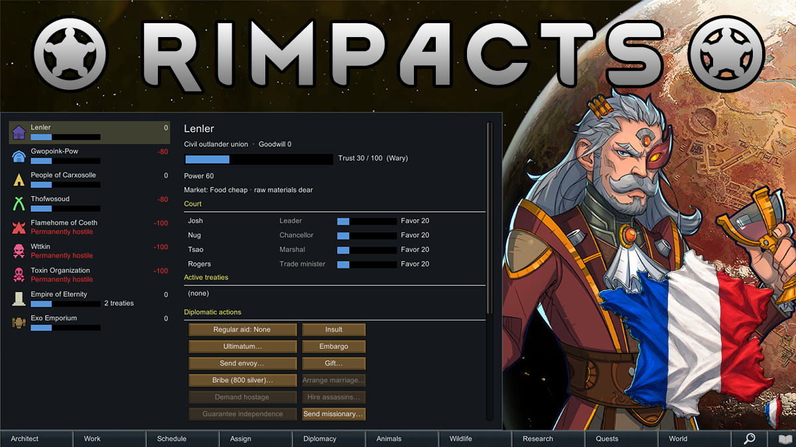

> [!WARNING]
> Le mod est encore en développement. Testez les nouvelles versions sur une copie de sauvegarde et signalez les anomalies rencontrées en jeu.

# RimPacts — Traduction française

Traduction française de **RimPacts - Diplomacy Overhaul** pour RimWorld 1.6.

## Prérequis

- RimWorld 1.6
- [RimPacts - Diplomacy Overhaul](https://steamcommunity.com/sharedfiles/filedetails/?id=3762723122)

## Installation

1. Téléchargez la dernière archive depuis les [releases GitHub](https://github.com/labkiezys/RimPacts-French/releases/latest).
2. Extrayez le dossier dans le répertoire `Mods` de RimWorld.
3. Activez d'abord **RimPacts - Diplomacy Overhaul**, puis **RimPacts - Traduction française**.

## Signaler un problème

Indiquez le texte concerné, le contexte en jeu et, si possible, joignez une capture d'écran.
